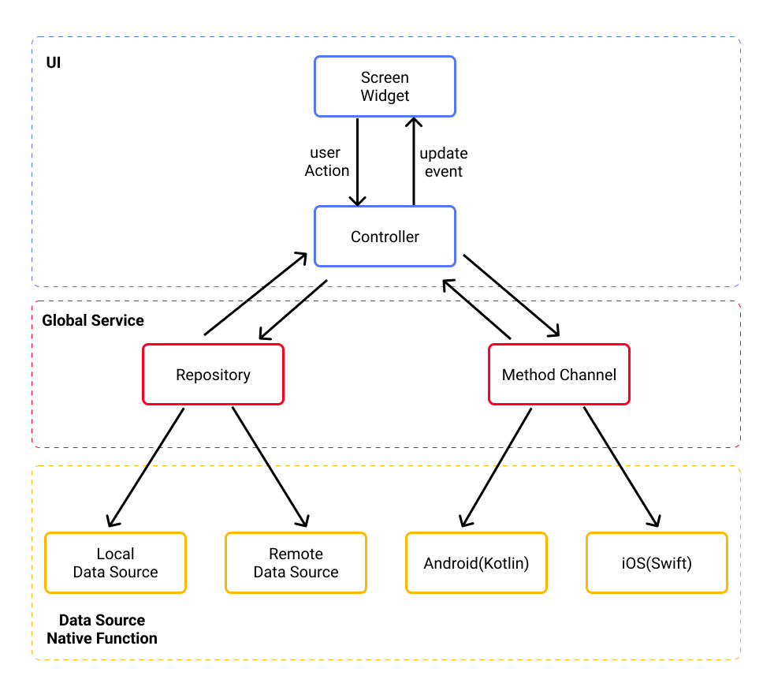

# ZMoviesFlutter

`ZMoviesFlutter` is an example app that built with Flutter.<br/>
It uses [TheMovieDB](https://www.themoviedb.org/) Api as data source to show Movie List and Detail.<br/>
The main purpose is to show how to make a real world app using Flutter,start with design the data flow and architecture.


## Environment

- iOS <br/>
    13.0
- Android <br/>
    minSdkVersion:24.0 <br/>
    targetSdkVersion: 30.0
- Flutter <br/>
    2.8.1

```
[✓] Flutter (Channel stable, 2.8.1, on macOS 12.1 21C52 darwin-arm, locale ja)
[!] Android toolchain - develop for Android devices (Android SDK version 32.0.0-rc1)
    ! Some Android licenses not accepted.  To resolve this, run: flutter doctor --android-licenses
[✓] Xcode - develop for iOS and macOS (Xcode 13.2.1)
[✓] Chrome - develop for the web
[✓] Android Studio (version 2020.3)
[✓] VS Code (version 1.63.2)
```

## App Architecture & Data Flow


It is a MVVM-like architecture.<br/>
Here is the basic principle for editing each layer:
- UI <br/>
  - draw ui
  - control ui data & business logic 
- GLobal Service <br/>
  - handle global event. eg.local settings update.
  - handle data converting (JSON<->Model).
  - store global data.
- Data Source and Native Function <br/>
  - do specific job. eg.networking,local storage.
  - communicate with native source

## Main Folders

|No.|Folder|Sub Folder|Detail|
|--|--|--|--|
|1|lib|ui/screen|draw UI for each screen|
|2||ui/widget|draw UI widgets(for reusing)|
|3||ui/controller|control data & business logic for each screen|
|4|data|datasource/remote|network api|
|5||datasource/local|local storage|
|6|service||global service|
|7|exception||customized exception|
|8|extension||extensions|
|9|getx||customized subclass of GetX.|
|10|util||tool classes/functions|

## Packages
### Dependencies
|No.|Package|Version|Licence|Detail|Link|
|--|--|--|--|--|--|
|1|[get](https://pub.dev/packages/get)|4.6.1|[MIT](https://pub.dev/packages/get/license)|for UI statement managing and dependencies managing||
|2|[freezed_annotation](https://pub.dev/packages/freezed_annotation)|1.1.0|[MIT](https://pub.dev/packages/freezed_annotation/license)|for model defination||
|3|[dio](https://pub.dev/packages/dio)|4.0.4|[MIT](https://pub.dev/packages/dio/license)|for networking||
|4|[retrofit](https://pub.dev/packages/retrofit)|3.0.1|[MIT](https://pub.dev/packages/retrofit/license)|for networking(generate IF)||
|5|[shared_preferences](https://pub.dev/packages/shared_preferences)|2.0.12|[BSD-3-Clause](https://pub.dev/packages/shared_preferences/license)|for local storage||
|6|[cached_network_image](https://pub.dev/packages/cached_network_image)|3.2.0|[MIT](https://pub.dev/packages/cached_network_image/license)|UI widget||
### Develop Dependencies
|No.|Package|Version|Licence|Detail|Link|
|--|--|--|--|--|--|
|1|[mockito](https://pub.dev/packages/mockito)|5.0.17|[Apache2.0](https://pub.dev/packages/mockito/license)|for unit testing|--|
|2|[flutter_lints](https://pub.dev/packages/flutter_lints)|1.0.0|[BSD-3-Clause](https://pub.dev/packages/flutter_lints/license)|code style|--|
|3|[lints](https://pub.dev/packages/lints)|1.0.1|[BSD-3-Clause](https://pub.dev/packages/lints/license)|code style|--|
|4|[freezed](https://pub.dev/packages/freezed)|1.1.1|[MIT](https://pub.dev/packages/freezed/license)|for generating model class|--|
|5|[build_runner](https://pub.dev/packages/build_runner)|2.1.7|[BSD-3-Clause](https://pub.dev/packages/build_runner/license)|for source generating|--|
|6|[retrofit_generator](https://pub.dev/packages/retrofit_generator)|4.0.1|[MIT](https://pub.dev/packages/retrofit_generator/license)|for api IF generating|--|
|7|[json_serializable](https://pub.dev/packages/json_serializable)|6.1.4|[BSD-3-Clause](https://pub.dev/packages/json_serializable/license)|for Json<->Model mapping |--|
|8|[flutter_launcher_icons](https://pub.dev/packages/flutter_launcher_icons)|0.9.2|[MIT](https://pub.dev/packages/flutter_launcher_icons/license)|for launcher icon generating|--|
|9|[flutter_gen_runner](https://pub.dev/packages/flutter_gen_runner)|4.1.5|[MIT](https://pub.dev/packages/flutter_gen_runner/license)|for assets generating|--|

## TODOs
- [ ] Built more screens
- [ ] Add some native functions
- [ ] Add some 3rd party services


## Also see
These repos are referenced when building this app.
- [flutter-architecture-blueprints](https://github.com/wasabeef/flutter-architecture-blueprints)
- [MovieSwiftUI](https://github.com/Dimillian/MovieSwiftUI)

## Preview
